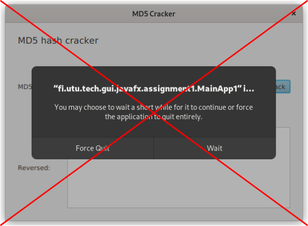
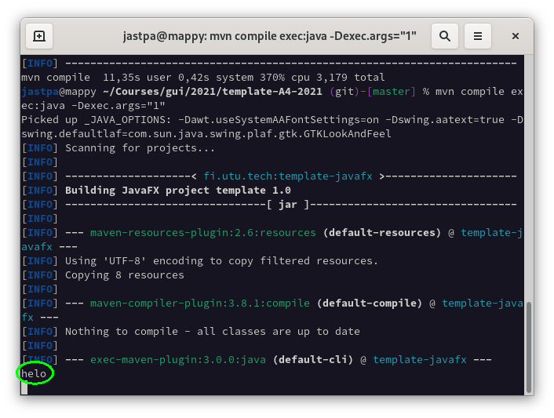
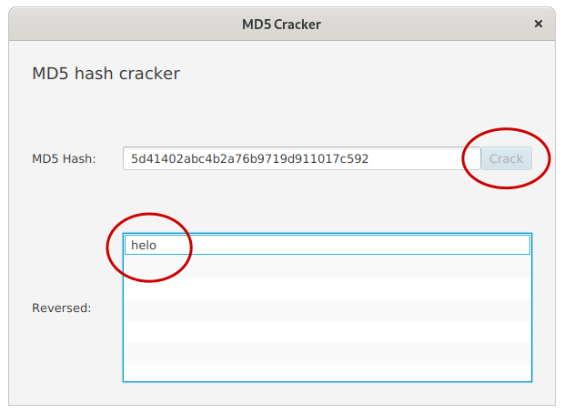
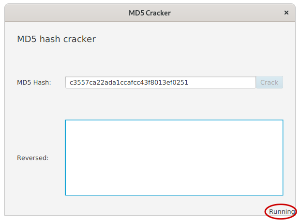
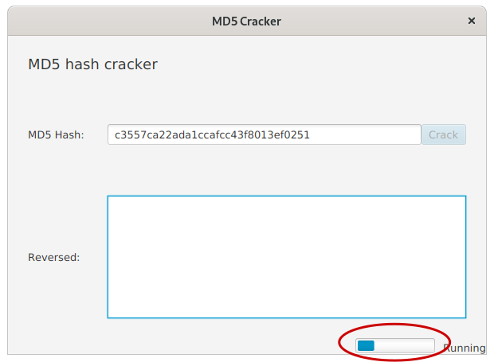
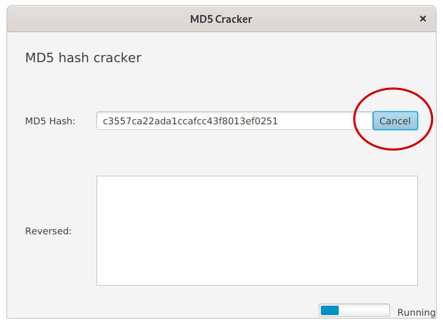

# Tehtävänanto A4

Tämän viikon pääaiheena on samanaikaisuus käyttöliittymäohjelmoinnissa sekä Javan sekä JavaFX:n tähän tarjoamat abstraktiot. Näihin abstraktioihin lukeutuu muun muassa säikeet, Runnable-, Task-, ja Service-oliot sekä muut käyttöliittymän ja ulkoisten säikeiden kommunikointiin liittyvät asiat.


## Taustaa
Näiden harjoitustöiden teemana toimii  MD5-tiivistearvojen kääntäminen takaisin alkuperäisarvoonsa, eli murtaminen, käyttäen brute force -menetelmää. Vaikka tehtävien teko ei vaadi ymmärrystä tiivistearvoista, pieni taustoitus lienee paikallaan.

Tiivistearvoja käytetään esimerkiksi salasanojen tallentamiseen. Salasanoja tallennettaessa salasana ajettaisiin tiivistefunktion läpi, joka tuottaisi *tiivistearvon* (hash). Tämä tiivistearvo tallennettaisiin tietokantaan. Tiivistearvon ominaisuuksiin kuuluu yksisuuntaisuus, eli tiivistearvo on nopea muodostaa tiedettäessä lähtöarvo, mutta tiivistearvon kääntäminen takaisin lähtöarvoksi on laskennallisesti raskasta. Tämän ansiosta salasanan tarkistus olisi nopeaa, mutta sen selvittäminen tietomurron sattuessa hidasta. 

- `qwertyui -> 22d7fe8c185003c98f97e5d6ced420c7` nopea
- `22d7fe8c185003c98f97e5d6ced420c7 -> qwertyui` hidas

Brute force -menetelmässä muodostetaan automaattisesti lähtöarvoja, joille lasketaan tiivistearvoja. Näitä tiivistearvoja verrataan murrettavaan tiivistearvoon niin kauan, kunnes vastaavuus löydetään tai generoitavat lähtöarvot loppuvat. Mitä useampia merkkejä ja mitä pidempiä merkkijonoja joudutaan testaamaan, sitä kauemmin selvitys kestää. Yksinkertaistetusti menetelmässä vain "kokeillaan" useita eri salasanoja.

*Huom! Tällä metodilla on mahdollista selvittää salasanoja, mikäli salasanan tiivistearvo on saatavilla. Tämän pitäisi olla sanomattakin selvää, mutta tietovuodonkin sattuessa salasanojen murto ja muut tietosuojaa rikkovat toimet ovat laittomia. Tulevina alan asiantuntijoina teidän on kuitenkin hyvä tuntea myös joitakin murtokeinoja niiden välttämiseksi omissa ohjelmistoissanne. Jos tästä ei muuta jää käteen, niin ainakin hyvien salasanojen merkitys pitäisi tulla selväksi.*

## Yleiset ohjeet
Viikkotehtävien alakohdat tulisi tehdä niille varattuihin kansioihin (hakemistopuussa `src/main`): eli siis tämän viikon (A4) ensimmäinen harjoitus tulisi tehdä kansioon "assignment1" ja toinen harjoitus kansioon "assignment2" jne. (ks. kuva). **Kuten aikaisempina viikkoina**, osa tehtävien tiedostoista tulee asettaa `src/main/resources`-hakemistopuun alle. Tämä koskee lähinnä FXML-tiedostoja.


Halutun harjoitustyön pystyy käynnistämään antamalla ohjelmaa käynnistäessä komentoriviparametrina ("command line argument/parameters") tehtävänumeron. 

Maven-koontityökalua käyttäen kääntö ja ohjelman suoritus:

```
mvn compile exec:java -Dexec.args="tehtävänumero"
```

Esim. jos halutaan ajaa tehtävä 3:

```
mvn compile exec:java -Dexec.args="3"
```

Kun käytät jotakin kehitysympäristöä, kuten Eclipseä, VSCodea tai IntelliJ:tä, on niissä jokaisessa omat tapansa antaa suoritettavalle ohjelmalle komentoriviparametrinsa. Nämä tavat selviävät tarkastelemalla kehitysympäristön dokumentaatiota, mikäli asia ei ole ennalta tuttu.


## Ohjelman käyttö
Ohjelmaa voi testata antamalla tiivistearvoja tekstilaatikkoon ja painamalla "Crack". Tiivistearvoja voi generoida joko viimekertaisen MD5-summalaskurin avulla, tai sitten komentoriviltä komennolla (toimii myös virtuaalikoneella):

`echo -n lähtöarvo | md5sum`

Echolle annettava `-n` -parametri estää rivinvaihdon lisäämisen tiivistettävään arvoon, joka laskettaisiin muutoin 1-2 merkkinä.

Mikäli et halua generoida omia tiivisteitä, voit käyttää seuraavia:

- `2510c39011c5be704182423e3a695e91` - h
- `6f96cfdfe5ccc627cadf24b41725caa4` - he
- `46356afe55fa3cea9cbe73ad442cad47` - hel
- `c3557ca22ada1ccafcc43f8013ef0251` - helo
- `5d41402abc4b2a76b9719d911017c592` - hello (Oletusasetuksilla (depth=4) tämä on liian pitkä sana ratkaistavaksi)

Testattavan sanan maksimipituutta voi kontrolloida `bruteForce()`-metodin `depth`-parametrilla. 3-4 merkkiä pitkät arvot ovat keskimäärin melko siedettäviä laskea, mutta 5 alkaa olemaan kipurajoilla. Mukana tulevalla sanakirjalla syvyydellä 4 testataan 23 000 461 salasanaa kun taas syvyydellä 5 vastaava luku on 1 587 031 810, eli ero on huomattava.

## Tehtävä 1 - Murtotyökalun säikeistys (0,5p)
Tehtävässä 1 on annettu valmiina käyttöliittymä, tiivistearvojen murtoon tehty luokka ja esimerkki sen käytöstä MD5-tiivisteiden murtoon. Ensimmäisen tehtävän rungossa **laskennan tulos ei ilmesty käyttöliittymään, vaan komentoriville**.

Ongelmana annetussa rungossa on kuitenkin se, että käyttöliittymä lukittautuu aina kun murtoalgoritmia käytetään. Eli toisin sanoen laskennan aikana ohjelman käyttöliittymä ei vastaa käyttäjän syötteeseen. Käynnistä murtoalgoritmi omassa säikeessänsä käyttäen Runnable-rajapintaa, jotta käyttöliittymä pysyisi responsiivisena myös laskennan aikana. Tulos saa edelleen tulostua komentoriville tehtävän valmistuttua.

 


## Tehtävä 2 - Living on the edge - Käyttöliittymän päivitys säieturvattomasti (0,5p)
Tehtävän 1 tavoin käyttöliittymä lukittautuu tämänkin tehtävän alkutilanteessa. Erona on, että pohja päivittää tuloksen käyttöliittymään, tarkemmin ListView-tyyppiseen `reversedList`-komponenttiin. Säikeistä suoritus käyttäen Runnable-rajapintaa. Tämän lisäksi aseta "Crack"-painike epäaktiiviseen tilaan (`setDisabled(true)`) laskennan ajaksi. Laskennan päätyttyä painikkeen tulee taas olla painettavissa.

Käyttöliittymäkomponentteja ei tarvitse tämän tehtävän vastauksessa päivittää säieturvallisesti. Huomioi, että tämän vuoksi valmis vastaus saattaa silloin tällöin heittää poikkeuksia ja käyttäytyä muutenkin epävakaasti.




## Tehtävä 3 - Säieturvallisuus (0,5p)
Tehtävässä 2 käyttöliittymää pyydettiin päivittämään säikeessä tehdyn laskennan tuloksen perusteella. Tehtävässä ei kuitenkaan vaadittu, että käyttöliittymän päivitys tehtäisiin säieturvallisesti. JavaFX-ohjelman muokkaaminen JavaFX Application Thread -säikeen ulkopuolelta suoraan ei kuitenkaan ole sallittua, sillä käyttöliittymärakenteet eivät ole säieturvallisia. Käytännössä tällainen päivitys saattaa joskus onnistua, mutta siinä pelataan venäläistä rulettia [ohjelman vakauden suhteen](https://imgur.com/7Cgbhma).

Päivitä ulkoisen säikeen tuottama tulos käyttöliittymään säieturvallisesti käyttäen tehtävää 2 pohjana. Huomioi, että myös painikkeen uudelleenaktivointi tulee hoitaa säieturvallisesti. Ulkoisesti eroa tehtävän 2 käyttöliittymään ei ole.

*Vinkki: Platform.runLater()*

## Tehtävä 4 - Tehtävät (Task) (0,5p)
Muokkaa `HashCrackerTask` Task-tyyppiseksi olioksi ja päivitä laskennan tulos käyttöliittymään käyttäen Task-luokan tarjoamia tapahtumia. Käytä samaisia tapahtumankäsittelijöitä myös "Crack"-painikkeen uudelleenaktivointiin laskennan jälkeen.

Tässä tehtävässä **EI** siis tule käyttää `Platform.runLater()`-metodia, vaan tukeutua Task-luokan tarjoamiin mekanismeihin käyttöliittymäsäikeen sekä tehtäväsäikeen välisessä kommunikaatiossa.

Ulkoisesti ohjelma näyttää edelleen samalta kuin tehtävän 2 aikaan.

## Tehtävä 5 - Tilatietoja (0,5p)
Jatketaan tehtävästä 4. Lähetä päivityksiä tiivistearvon murtotehtävästä käyttäen Task-luokan tähän tarjoamia metodeita. Käyttöliittymän puolella sido (property binding) `statusLabel`-tekstikomponentti tehtävän viesteihin. Myöskään tässä (eikä tulevissakaan) tehtävässä ei tule käyttää enää `runLater()`-metodia. 

Tilatiedot tulevat olla seuraavat:
- *Initializing* kun bruteForce-laskentaa valmistellaan
- *Running* kun laskenta on aloitettu
- *Ready* kun laskenta on valmistunut



## Tehtävä 6 - Laskennan edistyminen (0,5p)
Jatketaan siitä, mihin tehtävässä 5 jäätiin. Kutostehtävän käyttöliittymäpohjassa on mukana edistymispalkki nimeltään `crackingProgressBar`. Päivitä laskennan edistyminen tähän edistymispalkkiin käyttäen Task-luokan tarjoamia metodeja ja reaktiivisia sidoksia. Task-luokassa on spesifi metodi edistymistiedon välittämiseen.



*Vinkki: BruteForce-metodin edistymisen tilan pystyy selvittämään WordIterator-luokan wi-oliolta: size() palauttaa iteraatioiden maksimilukumäärän ja getCurrentIndex() tämänhetkisen iteraation järjestysnumeron.*


## Tehtävä 7 - Please stop! (0,5p)
Jatketaan tehtävästä 6. Voit myös jatkaa tehtävästä 4, mikäli et ole tehnyt tehtäviä 5 tai 6. Lisää ohjelmaan mahdollisuus peruuttaa murtotehtävä seuraavalla tavalla: Kun laskenta on käynnissä, tulee Crack-painikkeen tekstinä lukea "Cancel". Muussa tapauksessa tekstinä on "Crack". Kun laskenta on käynnissä ja painiketta painetaan, tulee tehtävä keskeyttää. 

Käytä keskeytystoiminnallisuuden toteutukseen Task-luokan tarjoamia metodeita ja painikkeen tekstin muutoksiin reaktiivisia sidoksia. Toisin sanoen, sido painikkeen teksti tehtävän ajotilaan ("runningProperty").




## Tehtävä 8 - Palvelut (0,5p)
Tehtävä 8 suositellaan tekemään tehtävän 7 pohjalta, sillä Service-luokan edut näkyvät siitä selviten. Tehtävän toteutus tehtävän 4, 5 tai 6 päälle on kuitenkin myös sallittu.

Muokataan ohjelman rakennetta hyödyntämään JavaFX:n Service-luokkaa. Luo `HashCrackService`-luokkaan Service-luokan vaatimukset täyttävä rakenne, jonka avulla pystyt suorittamaan `HashCrackerTask`-tehtäviä. Muokkaa myös kontrolleriluokka, ml. sen komponentit hyödyntämään Service-luokkaa.

Lopputuloksena kontrolleriluokassa ei tulisi olla yhtäkään suoraa viittausta `HashCrackTask`-luokkaan, vaan murtotehtävä tulee hoitaa `HashCrackService`-luokan kautta.

Alla olevassa kuvakaappauksessa on tilanne, jossa palvelu on luotu, mutta tehtävää ei olla käynnistetty kertaakaan. Tämän vuoksi tehtävän edistyminen on "tuntematon", johon edistymispalkki reagoi kuvan tavoin. 


*Vinkki: Kontrolleriluokkaan on mahdollista luoda metodi `public void initialize()`, joka suoritetaan automaattisesti ohjelman käynnistyessä FXML-komponenttien lataamisen jälkeen. Verrattuna metodiin `start()`, etuna on pääsy kontrolleriluokan private-määreellä varustettuihin komponentteihin. Initialize-metodi saattaa olla kätevä mm. palveluiden luonnissa ja sen sitomisessa komponentteihin.*
